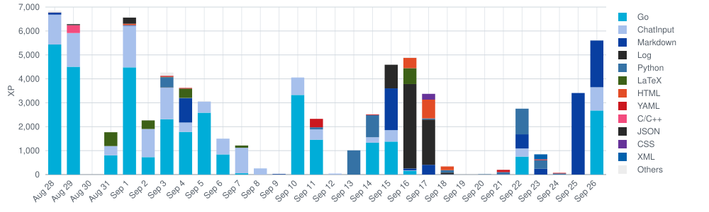

# Code::Stats Profile README Action

A reusable GitHub Action that generates a static Code::Stats history graph. Its layout is based on [WEGFan/codestats-profile-readme](https://github.com/WEGFan/codestats-profile-readme), while language colors come from the official [GitHub Linguist](https://github.com/github-linguist/linguist) definitions.

This repository contains only the graph generator. Generated history data and SVG files are written and committed to the repository that calls this Action, so this repository does not receive daily generated commits.

## How it works

- The first run fetches a complete 30-day window ending yesterday.
- Later runs fetch and replace yesterday's data only.
- The default timezone is `Asia/Shanghai`.
- The generated graph is `1000 x 300` pixels.
- History is stored in `data/codestats-history.json`.
- The SVG is written to `assets/codestats-history.svg`.
- Changed output files are automatically committed to the caller repository.
- Language colors are bound by language name, so colors do not change when language rankings change.

## Usage in a profile repository

Create `.github/workflows/update-code-stats.yml` in the profile repository:

```yaml
name: Update Code::Stats profile graph

on:
  schedule:
    # GitHub Actions uses UTC. This runs at 08:00 in Asia/Shanghai.
    - cron: "0 0 * * *"
  workflow_dispatch:
    inputs:
      date:
        description: "Optional date to retry (YYYY-MM-DD)"
        required: false
        type: string
      bootstrap:
        description: "Refresh the complete 30-day window"
        required: false
        type: boolean
        default: false

permissions:
  contents: write

concurrency:
  group: update-code-stats-profile
  cancel-in-progress: false

jobs:
  update:
    runs-on: ubuntu-latest
    steps:
      - uses: actions/checkout@v7
        with:
          fetch-depth: 0

      - uses: Haruko386/codestats-profile-readme@master
        with:
          date: ${{ inputs.date }}
          bootstrap: ${{ inputs.bootstrap }}
```

Then embed the generated image in the profile `README.md`:

```html
<a href="https://codestats.net/users/Haruko386">
  
</a>
```

## Manual runs and backfills

The workflow supports two optional inputs:

- `date` fetches one specific date, for example `2026-09-26`.
- `bootstrap`, when set to `true`, refreshes the complete 30-day window ending on the selected date or yesterday.

A manual run does not change or disable the daily schedule.

## Development

The generator uses only the Python standard library. Run the test suite with:

```bash
python -m unittest discover -s tests -v
```

This project is distributed under the MIT License inherited from the original project.
